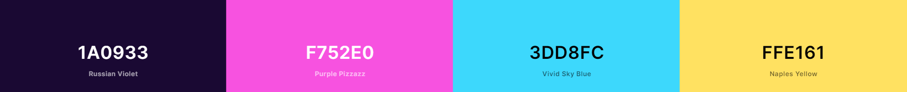

## Contents
* [Introduction](#Project-Name)
* [UX](#UX)
    * [User Stories](#User-Stories)
        * [First Time User Goals](#First-Time-User-Goals)
        * [Returning User Goals](#Returning-User-Goals)
        * [Site Owner Goals](#Site-Owner-Goals)
* [Structure](#Structure)
* [Design](#Design)
* [Wireframes](#Wireframes)
    * [Differences Between Wireframes and Final Product](#Differences-Between-Wireframes-and-Final-Product)
* [Features](#Features)
    * [Feature 1](#Feature-1)
* [Potential Future Features](#Potential-Future-Features)
* [Technologies Used](#Technologies-Used)
    * [Languages Used](#Languages-Used)
    * [Frameworks, Libraries & Programs Used](#Frameworks-,-Libraries-&-Programs-Used)
* [Testing](#Testing)
* [Deployment](#Deployment)
    * [Project Creation](#Project-Creation)
    * [Github Pages](#Heroku)
    * [Forking the GitHub Repository](#Forking-the-GitHub-Repository)
    * [Run Locally](#Run-Locally)
* [Credits](#Credits)
    * [Media](#Media)
---

# Pandgaming productions presents: Quarantine!

 

View the live project [here](https://sijil82.github.io/quarantine/index.html)

Quarantine is both a fun and easy-to-play game that takes inspiration from the very well known Breakout game! The objective of the game is to break all of the blocks by hitting them with a ball that is launched from the paddle that the user will use to maneuver the direction of the ball.

## UX
### User Stories

- As a user, I want to be able to know how the game works in an intuitive way
- As a user, I want to be able to find the instructions easily
- As a user, I want to have some music that would get me into the zone when gaming

## Structure

The page is designed to reflect the styling of the old Atari games. This includes color palete and the pixalated look of the images and fonts. 

The page consists of main game area and two additional pages, one with instructions and the other with more information. Each page has nav bar to enable the user to navigate easily. The footer has been designed so the user can familiarise themselves with the game creators. 

## Design
### Logo
The logo was designed to reflect retro gaming theme

### Colour Scheme
To get that retro gaming look we used a very vibrant colour scheme combined with some neon styling:

### Typography
For this project we used two [Google Fonts](https://fonts.google.com/): [Open Sans](https://fonts.google.com/specimen/Open+Sans?query=open) as our main font, and [Press Start 2P](https://fonts.google.com/specimen/Press+Start+2P?query=Press+Start+2P), a font with a pixelated look to emphasize some headings

### Imagery
* The paddle reflects the look of a pill

* the normal brick

* the virus brick

* the first aid brick

## Wireframes
* The website consists of 3 pages. Each page structure is identical. The general outline of the page was designed as per this [pdf document](quarantine/readme-files/wireframes.pdf).

## Features

### Different properties of each brick
* the normal brick - adds + 10 points to the game score
* the virus brick - speeds up the ball and adds 0 points to the game score
* the first aid brick - slows down the ball and adds 50 points to the game score

## Potential Future Features

* changing the size of the paddle depending which brick is hit
* more different bricks can be added with new properties

## Technologies Used 

### Languages Used 
* [HTML5](https://en.wikipedia.org/wiki/HTML5)
* [CSS3](https://en.wikipedia.org/wiki/CSS)
* [JavaScript](https://en.wikipedia.org/wiki/JavaScript)

### Frameworks, Libraries & Programs Used
* [Balsamiq](https://balsamiq.com/) was used to create the project's wireframes

* [Bootstrap](https://getbootstrap.com/) was used to create the layout and provide some styling

* [Bootwatch](https://bootswatch.com//) was used to change color palete provided by bootstrap

* [Fontawesome](https://fontawesome.com/)
    
* [Git](https://git-scm.com/)

* [GitHub](https://github.com/)

* [Google Dev Tools](https://developer.chrome.com/docs/devtools/)

* [Google Fonts](https://fonts.google.com/) was used to provide the fonts: Open Sans and Press Start 2P

* [Phaser js](https://phaser.io/)

* [Coolers.co](https://coolors.co/)

* [Canva](https://www.canva.com/) was used to create the game's logo and icon

* [Am I Responsive](http://ami.responsivedesign.is/)

## Testing
* HTML
    * No errors were returned when passing through W3C HTML validator.
    *  [W3C Validator](https://validator.w3.org/nu/?doc=https%3A%2F%2Fsijil82.github.io%2Fquarantine%2F)
* CSS
    * No errors were returned when passing through W3C CSS validator.  
    *  [W3C Validator](https://jigsaw.w3.org/css-validator/validator?uri=https%3A%2F%2Fvalidator.w3.org%2Fnu%2F%3Fdoc%3Dhttps%253A%252F%252Fsijil82.github.io%252Fquarantine%252F&profile=css3svg&usermedium=all&warning=1&vextwarning=&lang=en)   

## Deployment

### Project Creation
This project was created by using the following steps:

1. Log in to GitHub.
2. In the Repositories section, click the green "New" button.
3. Under "Repository template", select "Code-Institute-Org/gitpod-full-template".
4. Enter repository name.
5. Click "Create repository".
6. When re-directed, select the green "Gitpod" button. 

### GitHub Pages
This project was deployed to GitHub Pages using the following steps:

1. Log in to GitHub.
2. Select repository.
3. Navigate to and click the "Settings" button.
4. When re-directed, scroll down to the "GitHub Pages" section.
5. Under "Source", click the dropdown named "None" and select "Master Branch".
6. Click the "Save" button.
7. Upon page refresh, scroll down and locate the link to the live deployed page.

### Forking the GitHub Repository

Forking the GitHub repository allows us to make a copy of our original repository where changes can be made without affect the original copy.
To do this, follow these steps:

1. Log in to GitHub.
2. Select your repository.
3. Locate and click the "Fork" in the top right corner, under the nav bar.
4. A copy of the original repository should have been created in your GitHub account.

### Run Locally

1. Log in to GitHub.
2. Locate repository.
3. Locate and click the "Code" dropdown menu.
4. Under HTTPS, copy the URL.
5. Open your development editor and a terminal window in your chosen directory.
6. In the terminal, type "git clone " followed by the URL you copied in step 4 and press enter.
7. A clone of the project should have been created.

## Credits
### Media

Background music from [Joel Steudler](https://joelsteudler.itch.io/modern-day-music-mega-pack-vol-2)

Sound Effects from [Joel Steudler](https://joelsteudler.itch.io/modern-day-sfx) and [mixkit.co](https://mixkit.co/free-sound-effects/)